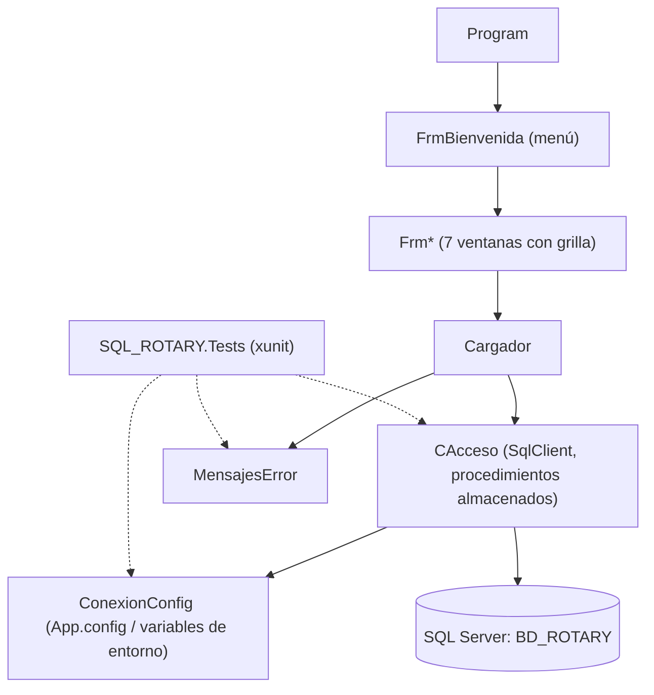

<div align="center">
  
  <h1>ClubGest</h1>
  <p><b>Visor de escritorio (solo lectura) de los registros de un club Rotary guardados en SQL Server.</b></p>
  
  
  
  
  <br />
  
  <p>
    <a href="#-inicio-rápido">Inicio rápido</a> ·
    <a href="#-características">Características</a> ·
    <a href="#-arquitectura">Arquitectura</a> ·
    <a href="#-pruebas">Pruebas</a> ·
    <a href="#-lo-que-todavía-no-existe">Limitaciones</a>
  </p>
</div>

ClubGest es una aplicación **Windows Forms** que **consulta** proyectos, eventos, recursos, finanzas, voluntarios, socios y beneficiarios de una base `BD_ROTARY` en SQL Server, ejecutando procedimientos almacenados `SPMOSTRAR...` y mostrando el resultado en una grilla. **No** inserta, modifica ni elimina datos: los botones *Guardar*, *Editar* y *Eliminar* existen en el diseño de las ventanas pero no tienen lógica asociada.

## 🎬 Vista rápida

No hay capturas: la aplicación necesita una instancia de SQL Server con la base restaurada. Flujo de uso:

```text
Program -> FrmBienvenida (menú principal)
  -> abre una ventana Frm* como diálogo (Proyectos, Eventos, Recursos,
     Finanzas, Voluntarios, Socios o Beneficiarios)
  -> Cargador ejecuta el procedimiento almacenado SPMOSTRAR...
  -> el resultado se muestra en la grilla
  -> si la BD no responde: mensaje comprensible, la app no se cierra
```

## ✨ Características

| Ventana | Procedimiento almacenado |
|---|---|
| Proyectos (`FrmProyecto`) | `SPMOSTRARPROYECTO` |
| Eventos (`FrmEventos`) | `SPMOSTRAREVENTO` |
| Recursos (`FrmRecursos`) | `SPMOSTRARRECURSOS` |
| Finanzas (`FrmFinanzas`) | `SPMOSTRARFINANZASS` |
| Voluntarios (`FrmVoluntarios`) | `SPMOSTRARVOLUNTARIOS` |
| Socios (`FrmSocios`) | `SPMOSTRARSOCIOS` |
| Beneficiarios (`FrmBeneficiarios`) | `SPMOSTRARBENEFICIARIOS` |

- Todo el acceso a datos usa procedimientos almacenados con parámetros tipados (sin SQL concatenado).
- Errores de SQL Server traducidos a mensajes legibles (`MensajesError`).
- Conexión configurable por `App.config` o variables de entorno, con protección frente a `;` en contraseñas.

## 🏗️ Arquitectura



<details>
<summary>Estructura de carpetas</summary>

```
SQL_ROTARY/           Aplicación WinForms (.csproj clásico, .NET Framework 4.7.2)
SQL_ROTARY.Tests/     Pruebas xunit (net8.0) de la lógica sin interfaz
BD_ROTARY.bak         Copia de seguridad de la base (ver Seguridad)
SQL_ROTARY.sln
.github/workflows/ci.yml
```

</details>

## 🚀 Inicio rápido

| Requisito | Detalle |
|---|---|
| Windows | .NET Framework 4.7.2 y Visual Studio 2022 (o MSBuild) |
| SQL Server / Express | Con `BD_ROTARY` restaurada desde `BD_ROTARY.bak` |
| NuGet | `FontAwesome.Sharp 6.6.0` (se restaura solo) |

1. Restaura `BD_ROTARY.bak` en tu instancia de SQL Server (SSMS: *Restaurar base de datos*). No verifiqué la restauración ni el esquema al escribir este README.
2. Configura la conexión en `SQL_ROTARY/App.config` o con variables de entorno (tienen prioridad).
3. Abre `SQL_ROTARY.sln` en Visual Studio y ejecuta, o compila:

```bash
nuget restore SQL_ROTARY.sln
msbuild SQL_ROTARY.sln /p:Configuration=Release
```

<details>
<summary>Variables de conexión</summary>

| Clave | Por defecto | Notas |
|---|---|---|
| `ROTARY_SQL_SERVER` | `.\SQLEXPRESS` | Instancia de SQL Server |
| `ROTARY_SQL_DATABASE` | `BD_ROTARY` | |
| `ROTARY_SQL_USER` | *(vacío)* | Vacío = autenticación integrada de Windows |
| `ROTARY_SQL_PASSWORD` | *(vacío)* | Solo con usuario; no la escribas en un archivo versionado |

</details>

## 🧪 Pruebas

20 pruebas xunit (todas pasan al escribir este README) sobre la cadena de conexión (incluida la protección frente a `;`), el mapeo de parámetros de `CAcceso` y los mensajes de error.

```bash
dotnet test SQL_ROTARY.Tests/SQL_ROTARY.Tests.csproj
```

No hay pruebas de las ventanas ni de integración contra SQL Server. CI (`.github/workflows/ci.yml`) ejecuta las pruebas y compila la aplicación en `windows-latest`.

## 🔒 Seguridad

- **Advertencia:** `BD_ROTARY.bak` está versionado desde el historial original y puede contener datos personales. No publiques ni compartas el repositorio sin revisar ese archivo; retirarlo del historial es decisión del propietario.
- No hay credenciales en el código: la conexión se configura por `App.config` o variables de entorno; por defecto usa autenticación integrada de Windows.
- Sin inicio de sesión propio: el acceso depende de los permisos de SQL Server.

## 🚧 Lo que todavía no existe

- Alta, edición y baja de registros (los botones existen sin lógica).
- Autenticación de usuarios, roles y validación de formularios.
- Un componente base compartido: las siete ventanas repiten la misma estructura.
- Diseño de ventana adaptable e internacionalización (diseño fijo).
- Script de esquema con datos ficticios para reemplazar el `.bak`.

## 📄 Licencia

Sin licencia definida: todos los derechos reservados por defecto.

<div align="center"><sub>Hecho por Luiss2080 · C# · Windows Forms · SQL Server</sub></div>
